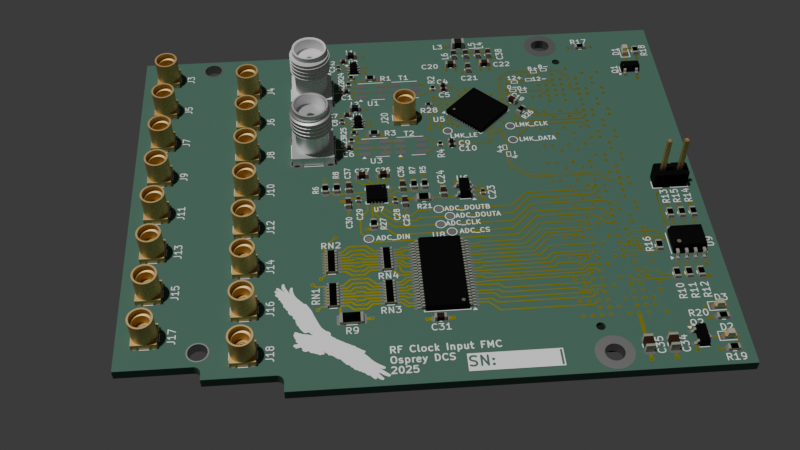

# RF Input FMC

A single width HPC FMC board which brings in two high frequency (RF) clocks to
to MGT capable pins when matched with the [LBL Marble](https://github.com/BerkeleyLab/Marble) FMC carrier.

This design is Open Hardware created by Osprey DCS and published under the terms of the
[CERN Open Hardware Licence Version 2 - Strongly Reciprocal](cern_ohl_s_v2.txt) license.

This repository contains KiCad 9 design files.

- [Data sheet](datasheet.md)
- [Current generated](https://mdavidsaver.github.io/rf-input-fmc/)
  - [Schematic](https://mdavidsaver.github.io/rf-input-fmc/rf-input-fmc-schematic.pdf)
  - [BoM](https://mdavidsaver.github.io/rf-input-fmc/rf-input-fmc-bom.csv)
  - [STeP model](https://mdavidsaver.github.io/rf-input-fmc/3D/rf-input-fmc-3D.step)

## Block Diagram

## Status

Incomplete, under development, and not yet produced.

